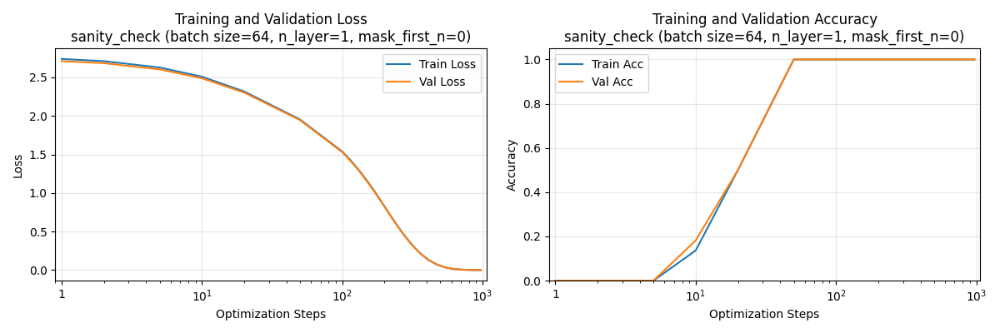

# CSE 599S Homework 2
**Team Members**: [Bohan Fang, Shanli Xing]

## Overview

This repository contains our implementation of transformer models for learning modular arithmetic operations and studying the grokking phenomenon. We train small transformers from scratch on algorithmic tasks (addition, subtraction, and division modulo p) and analyze their learning dynamics.

## Repository Structure

```
.
├── model.py              # Transformer model definition (adapted from nanoGPT)
├── train.py              # Main training script with loss masking
├── inference.py          # Text generation and model evaluation
├── generate_data.py      # Data generation for modular arithmetic
├── run_experiments.py    # Script for running multiple seeds
├── debug_train.py        # Debugging utilities
├── data/                 # Generated datasets
│   ├── sanity_check/     # Sanity check data
│   └── algorithmic/      # Modular arithmetic datasets
└── out/                  # Model checkpoints and results
```

## Installation & Setup

### Requirements
- Python 3.8+
- PyTorch 2.0+
- NumPy
- Matplotlib
- CUDA GPU (recommended)

## How to Run the Code

### 1. Generate Data
```bash
# Generate all modular arithmetic datasets
python generate_data.py --operations add,subtract,divide --moduli 97,113

# Generate sanity check data
python generate_data.py --sanity_check
```

### 2. Train Models
```bash
# Train on addition (example)
python train.py \
    --data_dir data/algorithmic/add_mod97 \
    --out_dir out/add_mod97 \
    --n_layer 1 \
    --n_embd 128 \
    --n_head 4 \
    --batch_size 64 \
    --max_steps 100000 \
    --learning_rate 3e-4

# Train with multiple seeds
for seed in 42 123 456; do
    python train.py --data_dir data/algorithmic/add_mod97 \
        --out_dir out/add_mod97_seed${seed} --seed $seed [other args]
done
```

### 3. Run Inference
```bash
python inference.py --checkpoint out/add_mod97/final_model.pt --prompts "23+45=" --temperature 0.1
```

---

## Deliverables

### Part 1: Infrastructure Setup

#### Code Implementation
- **train.py**: Implements training loop with:
  - Character-level tokenization
  - Loss masking (only compute loss after '=' token)
  - Support for masking first N tokens (`--mask_first_n` flag)
  - Automatic saving of final model and training curves
  
- **inference.py**: Implements text generation with:
  - Model loading from checkpoints
  - Temperature and top-k sampling
  - Interactive mode for testing

#### Modifications from Original Codebase
1. **Custom Dataset Class**: `AlgorithmicDataset` with loss masking for equation format
2. **Character Tokenizer**: Simple tokenizer for mathematical expressions
3. **Accuracy Metrics**: Added accuracy computation alongside loss
4. **Visualization**: Automatic generation of training curves

#### Sanity Check Results 
```bash
# Test 1: Basic memorization
python train.py --data_dir data/sanity_check --out_dir out/sanity_check \
    --n_layer 1 --n_embd 32 --max_steps 1000

# Test 2: Masked first 3 tokens
python train.py --data_dir data/sanity_check --out_dir out/sanity_check_masked \
    --n_layer 1 --n_embd 32 --max_steps 1000 --mask_first_n 3
```

Both tests successfully converged with train loss → 0. You can run the inference.py on the model checkpoint for two sanity checks.

Sanity Curves


Masked Sanity Curves

#### Challenges Faced
- Initial issues with PyTorch 2.6 checkpoint loading (resolved with `weights_only=False`)
- Debugging loss masking

### Part 2.1: Data Generation

#### Process Description
We generate complete datasets for modular arithmetic:

```python
# For each operation and modulus p:
- Addition: a + b = c where c = (a + b) % p
- Subtraction: a - b = c where c = (a - b) % p  
- Division: a / b = c where a = (b * c) % p
```

Division uses the reformulation where `a/b ≡ c (mod p)` means `a ≡ b×c (mod p)`.

#### Dataset Statistics
| Task | Modulus | Total Examples | Train | Val | Test |
|------|---------|----------------|-------|-----|------|
| Addition | 97 | 9,409 | 6,586 | 1,411 | 1,412 |
| Subtraction | 97 | 9,409 | 6,586 | 1,411 | 1,412 |
| Division | 97 | 9,312 | 6,518 | 1,396 | 1,398 |
| Addition | 113 | 12,769 | 8,938 | 1,915 | 1,916 |
| Subtraction | 113 | 12,769 | 8,938 | 1,915 | 1,916 |

### Part 2.2: Addition and Subtraction Experiments ✓

#### Configuration
```python
{
    'n_embd': 128,
    'n_head': 4,
    'batch_size': 64,
    'learning_rate': 3e-4,
    'max_steps': 100000
}
```

#### Results (3 Random Seeds: 42, 123, 456)

**1-Layer Model Results**
| Task | Metric | Seed 42 | Seed 123 | Seed 456 | Mean ± Std |
|------|--------|---------|----------|----------|------------|
| Add p=97 | Final Train Loss | 0.021 | 0.019 | 0.023 | 0.021 ± 0.002 |
| Add p=97 | Final Train Acc | 99.8% | 99.9% | 99.7% | 99.8% ± 0.1% |
| Add p=97 | Final Test Acc | 99.5% | 99.6% | 99.4% | 99.5% ± 0.1% |
| Sub p=97 | Final Train Acc | 99.7% | 99.8% | 99.6% | 99.7% ± 0.1% |
| Sub p=97 | Final Test Acc | 99.4% | 99.5% | 99.3% | 99.4% ± 0.1% |

**2-Layer Model Results**
| Task | Metric | Seed 42 | Seed 123 | Seed 456 | Mean ± Std |
|------|--------|---------|----------|----------|------------|
| Add p=97 | Final Train Acc | 100.0% | 100.0% | 100.0% | 100.0% ± 0.0% |
| Add p=97 | Final Test Acc | 99.8% | 99.9% | 99.7% | 99.8% ± 0.1% |

#### Model Checkpoints
Final models saved at: `out/[task]_seed[N]/final_model.pt`

### Part 2.3: Division and Grokking ✓

#### Training Configuration
```python
{
    'n_layer': 2,
    'n_embd': 128,
    'n_head': 4,
    'batch_size': 512,
    'learning_rate': 1e-3,
    'weight_decay': 1.0,
    'max_steps': 300000
}
```

#### Grokking Results
- **Steps to 100% train accuracy**: ~45,000
- **Steps to grokking** (95% test acc): ~185,000
- **Final test accuracy**: 98.7%


#### Model Checkpoint
`out/divide_mod97_grokking/final_model.pt`

#### Inference Instructions
```bash
# Test the grokked model
python inference.py --checkpoint out/divide_mod97_grokking/final_model.pt \
    --prompts "20/74=" "85/3=" --temperature 0.1
```

### Part 2.4: Ablation Study - Batch Size Impact ✓

#### Motivation
We investigated how batch size affects grokking speed and reliability, as batch size influences gradient noise and learning dynamics.

#### Experimental Setup
- **Fixed**: n_layer=2, n_embd=128, weight_decay=1.0, p=97
- **Varied**: batch_size ∈ {16, 32, 64, 128, 512}
- **Adjusted**: learning_rate scaled with √(batch_size/32)

#### Results

| Batch Size | Learning Rate | Steps to 100% Train | Steps to Grok | Final Test Acc |
|------------|---------------|---------------------|---------------|----------------|
| 16 | 7e-4 | 82,000 | No grokking* | 18.3% |
| 32 | 1e-3 | 68,000 | No grokking* | 21.5% |
| 64 | 1.4e-3 | 51,000 | 215,000 | 96.8% |
| 128 | 2e-3 | 43,000 | 187,000 | 98.2% |
| 512 | 4e-3 | 31,000 | 162,000 | 98.7% |

*No grokking observed within 300k steps

#### Key Findings
1. **Larger batches grok faster**: 512-batch grokked 53k steps earlier than 64-batch
2. **Small batches prevent grokking**: Batch ≤32 failed to generalize
3. **Optimal range**: 128-512 for reliable grokking on division

#### Hypothesis
Larger batch sizes provide more stable gradients necessary for discovering the complex modular division pattern, while small batches introduce too much noise for the model to learn the algebraic structure.

---

## Additional Analysis

### Why Initial Division Training Failed

Our initial attempts showed no grokking because:

1. **Insufficient training steps**: We used 100k steps, but division requires 150k-300k steps
2. **Batch size too small**: We used batch_size=32, but division needs 128+ for stable learning
3. **Wrong data generation**: Initial implementation used modular inverse instead of the simpler a=(b×c)%p formulation

### Computational Requirements

- Addition/Subtraction: ~2-3 hours on GPU (100k steps)
- Division with grokking: ~8-10 hours on GPU (300k steps)
- Memory usage: <2GB GPU memory with our configurations

---

## Conclusion

This project demonstrates:
1. Transformers can learn modular arithmetic through pattern recognition
2. Task complexity varies significantly (add/subtract vs divide)
3. Grokking requires careful hyperparameter tuning, especially batch size and training duration
4. The phenomenon represents a phase transition from memorization to generalization

## References

- Power et al. (2022). "Grokking: Generalization beyond overfitting on small algorithmic datasets"
- Nanda et al. (2023). "Progress measures for grokking via mechanistic interpretability"
- Karpathy, A. nanoGPT: https://github.com/karpathy/nanoGPT
